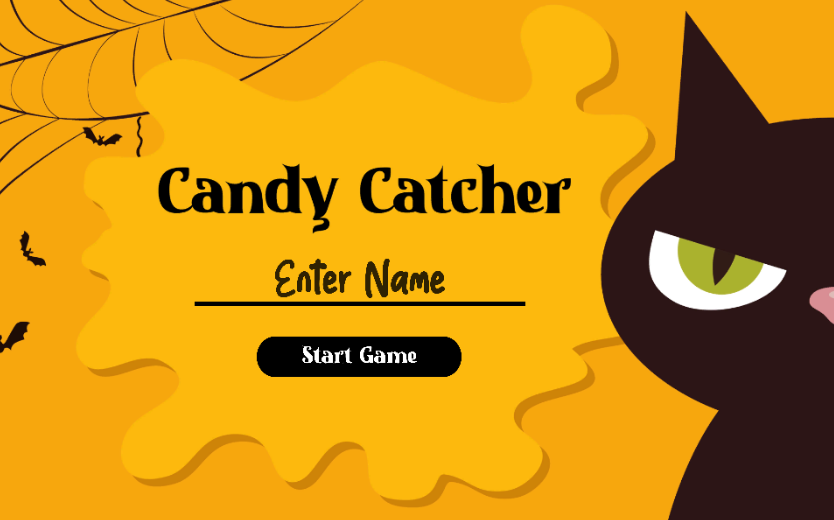
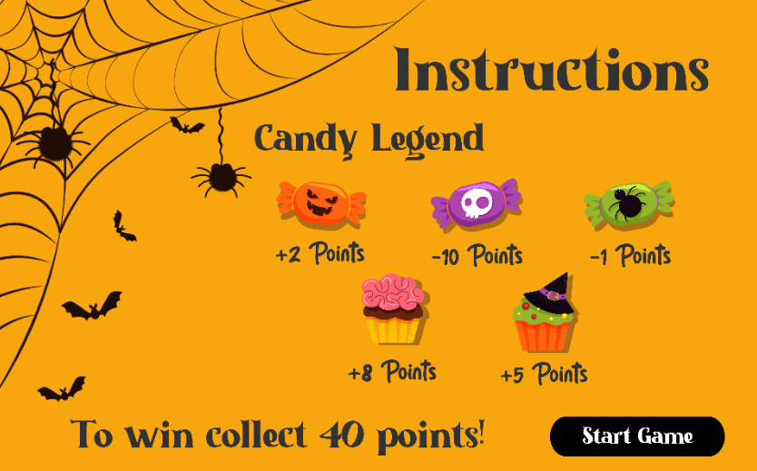
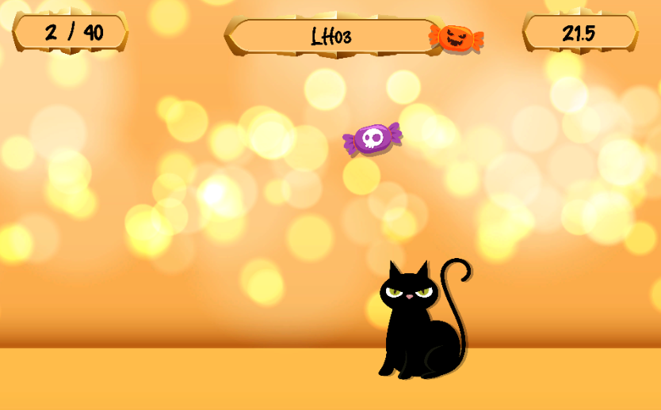
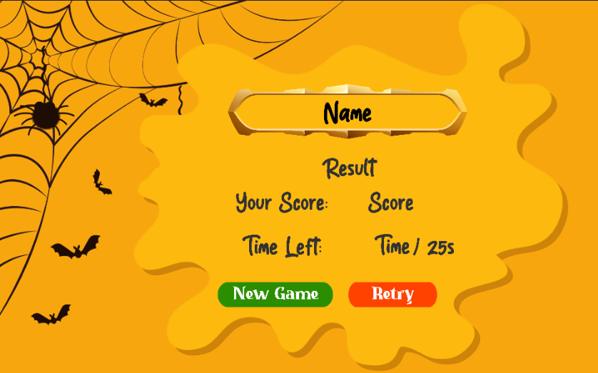

# 08CandyCatcher-LH03

### Project description:
Simple Candy Catcher Game - The player has to catch a 40 candies within 20 seconds to win.

### Github Pages Link:
https://5ahmnm2122.github.io/08CandyCatcher-LH03/

### Development platform: 
OS: Windows 10.0.19042, Unity 2020.3.18f1, Visual Studio Community 2019

### Target platform: 
WebGL 960x600

### Necessary setup/execution steps:
Unity Installation

### Visuals:

### Third party material:
ReadMe Template by smeerws

Background: https://www.freepik.com/free-vector/happy-halloween-with-black-cat_5678120.htm#query=halloween%20cat&position=32&from_view=search

Cat: https://www.freepik.com/free-vector/happy-halloween-with-black-cat_5678115.htm#&position=7&from_view=detail#&position=7&from_view=detail

Plaque: https://www.freepik.com/free-vector/empty-rectangle-frames-medieval-style-game-ui-design-vector-cartoon-set-user-interface-elements-with-golden-silver-border-with-leaves-gems-isolated-background_21845907.htm#query=rectangle%20frames%20medieval&position=0&from_view=search

Candies: https://www.freepik.com/free-vector/flat-design-halloween-candy-collection_5417759.htm#query=halloween%20candies&position=19&from_view=search

Sweet Candy Font: https://www.dafont.com/sweet-candy-3.font

Halloween Nightmare Font: https://www.freefonts.io/halloween-nightmare-font/

### Project state: 
100%

### Limitations: 
none

### Lessons Learned:
* How to work with scriptable ojects
* How scene management in unity works

Copyright by Lea Helbok

